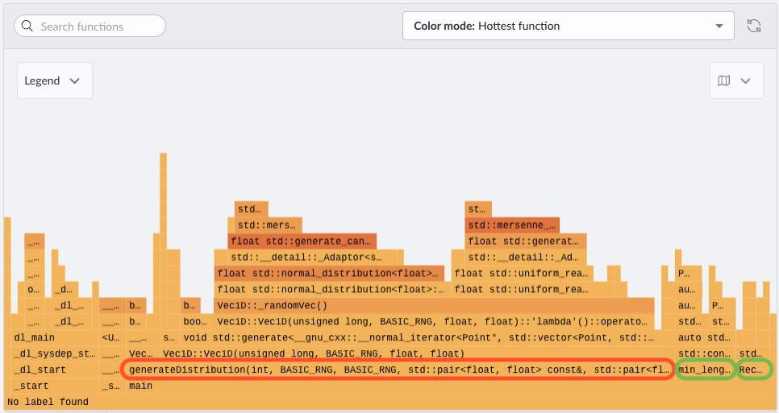

## Profile the baseline with Code Hotspots

Arm Performix includes a **Code Hotspots** recipe that shows which functions consume the most CPU time. This helps you prioritize optimization work based on evidence instead of intuition. If you have not come across flame graphs or sample-based profiling, please check out this introductory [learning path](https://learn.arm.com/learning-paths/servers-and-cloud-computing/cpu_hotspot_performix/).

In the Arm Performix GUI, run Code Hotspots on the baseline executable at `./build/src/main`.

This flame graph shows CPU time distribution across the call stack, where wider blocks indicate higher cumulative execution time. The dominant feature is the wide base associated with generateDistribution(...), indicating it is the primary hotspot and consumes the largest share of execution time.

Drilling into that region, most of the work comes from standard library random generation routines, particularly paths involving std::normal_distribution<float>. These stacks are visibly wider than those involving std::uniform_real_distribution<float>, indicating that Gaussian (normal) sampling is significantly more expensive in terms of CPU cycles than uniform sampling. This imbalance may not have been obvious from higher-level instrumentation, since both operations conceptually “generate random numbers,” but their computational cost differs substantially.

In contrast, functions related to computing properties like “number of points within a rectangle” or identifying a minimum point (e.g., min_length-type operations) occupy relatively narrow regions of the graph. This shows they contribute only a small fraction of total runtime and are not meaningful bottlenecks.

## What you've learned and what's next

You used profiling data to highlight which function to optimize. Next, you accelerate random generation by enabling OpenRNG through Arm Performance Libraries.
