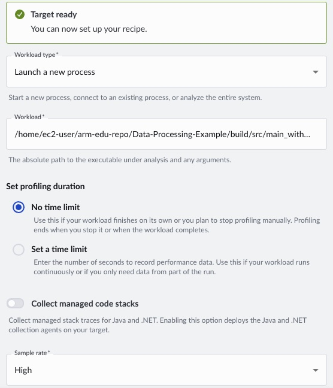
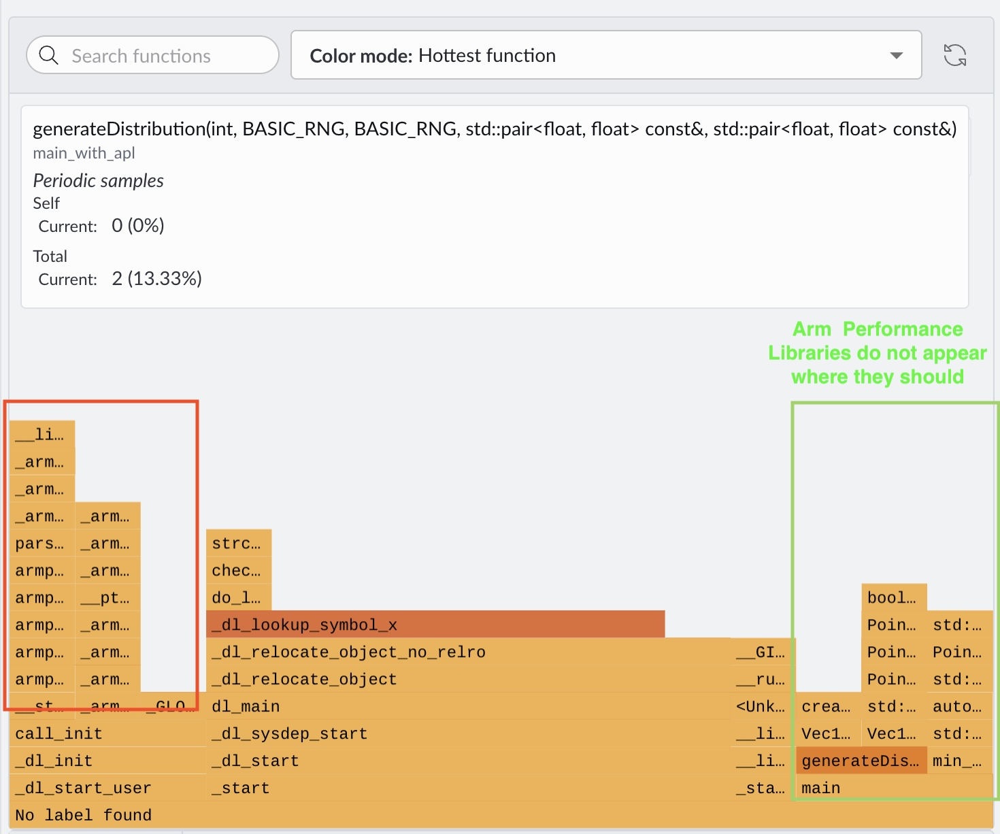
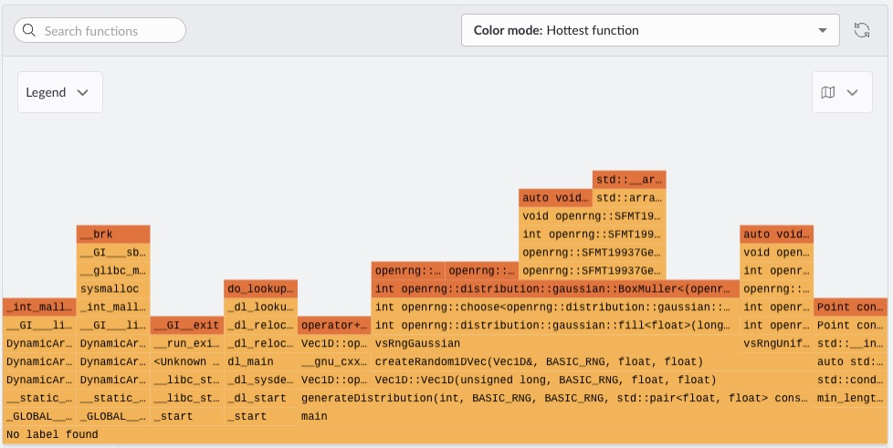

## Accelerate Hotspot with OpenRNG and Arm Performance Libraries

Arm Performance Libraries is a set of numerical routines tuned specifically for Arm processors, covering BLAS, LAPACK, FFT, sparse linear algebra, random number generation, and optimized math and string functions.

OpenRNG provides a Vector Statistical Library (VSL) API for high-throughput random number generation. The OpenRNG interface mirrors the Intel oneMKL VSL RNG interface, so your call sites stay the same when you move between x86 and AArch64 builds. See the [OpenRNG developer reference guide](https://developer.arm.com/documentation/101004/2601/Open-Random-Number-Generation-Reference-Guide/RNG-Introduction/An-overview-of-OpenRNG?lang=en) for more information.

VSL matters here because it generates many samples in bulk through a stream object. That approach reduces per-sample overhead and improves throughput for this example workload on Arm servers.

Because OpenRNG is API-compatible with the Intel VSL RNG interface, you can keep the same distribution calls across architectures without rewriting workload logic but updating preprocessor macros. In `src/vec1d.cpp`, the `USE_ARMPL` macro controls which implementation is compiled. In this project, enabling `USE_ARMPL` selects the AArch64 OpenRNG path:

```cpp
#if USE_ARMPL
    #if defined(__aarch64__)
        #include <amath.h>
        #include <openrng.h>
    #else
        #error "USE_ARMPL enabled but not on AArch64"
    #endif
#endif
```

The OpenRNG path creates one VSL stream and fills a contiguous buffer for both coordinates. `count` is set to `2 * v.getSize()` because each point has `x` and `y` values:

```cpp
VSLStreamStatePtr stream;
vslNewStream(&stream, VSL_BRNG_SFMT19937, 777);

const int count = 2 * v.getSize();
std::vector<float> tmp(count);
```

For Gaussian generation, the code calls the single-precision VSL API `vsRngGaussian` (often referred to as the VSL RNG Gaussian routine). Here, `param_a` is the mean and `param_b` is the standard deviation:

```cpp
vsRngGaussian(
    VSL_RNG_METHOD_UNIFORM_STD,
    stream,
    count,
    tmp.data(),
    param_a, // mean
    param_b  // standard deviation
);
```

After bulk generation, values are mapped back into your `Point` vector:

```cpp
auto& data = v.getData();
for (int i = 0; i < v.getSize(); i++){
    data[i]._x = tmp[2*i];
    data[i]._y = tmp[2*i+1];
}

vslDeleteStream(&stream);
```


Build the accelerated variant:

```bash
make clean
cmake -S . -B build -DUSE_APL=1
cmake --build build --target main_with_apl
./build/src/main_with_apl
```

## Analyze the flame graph

Now profile the accelerated binary in the Arm Performix GUI using `./build/src/main_with_apl` as the workload.



{}
If you encounter an error when trying to run the workload through Arm Performix, it's because the binary runs from a fresh environment without the Arm Performance Library environment module loaded. The easiest workaround is to add the `LD_LIBRARY_PATH` environment variable to your `.bashrc` file.

```bash

echo "export LD_LIBRARY_PATH=/opt/arm/arm-performance-libraries/lib:${LD_LIBRARY_PATH}" >> ~/.bashrc
```
Alternatively, if using the CLI, you can pass in the environment variable with the `--env` argument. As of Performix 2026.2.0, you are unable to pass through environment variables via the GUI.

{}

The flame graph shows main, but the Arm Performance Libraries (including openRNG) do not appear above it. Instead, most samples are attributed to dynamic loader functions (e.g., _dl_*), indicating missing symbol resolution. This commonly happens on Linux when using pre-built shared libraries (*.so) without debug symbols. The profiler cannot resolve internal library calls, so stacks appear truncated.

To fix this, rebuild openRNG from source with debug information enabled (e.g., -g), so the library functions show up correctly above main.



Run the following command from the root of the project directory to build `openrng` with debug.

```bash
git clone https://gitlab.arm.com/libraries/openrng.git && cd openrng
cmake -S . -B build -DCMAKE_BUILD_TYPE=Debug -DCMAKE_INSTALL_PREFIX=$PWD/install
cmake --build build -j $(nproc -1)
cmake --install build
```

Run the command below to compile from the root of the project directory.


```bash
g++ --std=c++20 -g -O0 \
  src/main.cpp src/vec1d.cpp src/point.cpp src/rectangle.cpp src/export_data.cpp \
  -DUSE_ARMPL=1 \
  -I./include \
  -I./openrng/install/include \
  -I${ARMPL_DIR}/include \
  -L./openrng/install/lib64 \
  -L${ARMPL_DIR}/lib \
  -lopenrng -lamath -lm \
  -Wl,-rpath,$PWD/openrng/install/lib64 \
  -Wl,-rpath,${ARMPL_DIR}/lib \
  -o ./build/debug_openrng
```

{}

OpenRNG uses the CMake build system, so as an alternative you can update your CMake configuration to fetch from the third-party library. The direct command above is used here primarily for convenience.

{}

From Performix, run the code hotspot recipe and target the `./build/debug_openrng` binary.



You can now correctly see the OpenRNG frames appearing above your calling functions. Because hotspots are identified through periodic sampling, the measurements provide limited direct insight into exact wall-clock time. Next, you will measure the speedup of the hot function and examine how it varies across different data sizes.