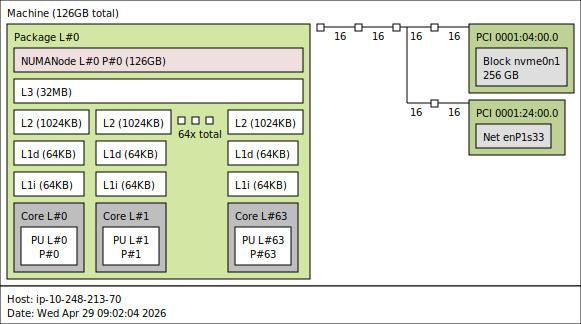

## Review the memory hierarchy

This learning path assumes you have a fundamental understanding of memory hierarchy. As such, this is not meant as an exhausive explanation but instead a recap focusing on the concepts discussed in the later worked example. 

Modern Arm server CPUs use a hierarchy of memories to reduce the cost of loading and storing data. The fastest storage sits close to each CPU core, while larger memories sit farther away and take more cycles to access.

You typically see:

- L1 data cache (`L1d`) and L1 instruction cache (`L1i`) close to each core. This may use the virtual address
- L2 cache, often private to each core.
- Last-level cache, often shared across multiple cores.
- DRAM, which is much larger but much slower than on-chip cache.

You can inspect cache topology on a Linux system with:

```bash
lscpu | grep -i cache
```

Example output:

```output
L1d cache:                               4 MiB (64 instances)
L1i cache:                               4 MiB (64 instances)
L2 cache:                                64 MiB (64 instances)
L3 cache:                                32 MiB (1 instance)
```

For a more visual view, install `hwloc` and generate a topology image:

```bash
sudo apt update
sudo apt install -y hwloc
hwloc-ls --of png > topology.png
```



The graphic above illustrates the size and access of different cache tiers on an AWS Graviton 3 metal instance, based on the Neoverse V1 architecture. Here we observe each of the 64 cores has private, `L1d`, `L1i` and `L2` cache, with all 64 cores sitting in the same cluster with shared `L3` cache (last level cache). Cache sizes, typically later levels, are not fixed by the Neoverse architecture version; implementers such as AWS or Google can configure more or less cache depending on their design goals. 

NUMA, or non-uniform memory access, means memory access latency can depend on which processor or socket owns the memory being accessed, for this AWS Graviton 3 instance there is only a single NUMA mode.

Ideally, the working set, which is the data a program actively touches during a period of execution, or the resident set size (RSS), which is the physical memory currently resident for a process, fits within the lowest practical cache tier for lowest ltency. 

A more considered approach is required when multiple threads are in use, also consider how multiple cores read and write shared data so you can avoid issues such as false sharing. For more information, see [Learn how false sharing impacts application performance using Arm SPE](https://learn.arm.com/learning-paths/servers-and-cloud-computing/false-sharing-arm-spe/).

 If you would like a comprehensive understanding of the memory subsystem, review our learning path on the [Arm system characterisation tool](https://learn.arm.com/learning-paths/servers-and-cloud-computing/memory-subsystem/).

## Overview of the Memory Management Unit (MMU) 

Applications use virtual addresses, which are the memory addresses a program sees rather than the actual locations in physical DRAM. Virtual addressing lets the operating system isolate processes, protect memory, and map each program's address space onto available physical memory. The processor translates virtual addresses to physical addresses before it can access memory. 

### Translation lookaside buffer (TLB)

The translation lookaside buffer (TLB) caches recent virtual-to-physical translations on a page level to avoid time spent performing a page table walk. A TLB miss occurs when the needed translation is not already cached.  The processor then performs a page table walk to find the mapping. Page walks add latency before the load or store can complete. Large working sets and irregular access patterns, such as accessing data a strides greater than the typical 4KB page size can increase TLB pressure because the program touches many pages with little reuse.

### Page Faults

A minor page fault is usually harmless: the data is already in RAM, and the kernel just creates the mapping, which commonly happens during anonymous paging when Linux lazily backs newly allocated heap/stack memory on first touch. A major page fault is more expensive because the kernel must fetch the page from disk, such as from a file or swap, so repeated major faults are usually a real performance concern.

### Working size

The working set is the data your program actively touches during a period of execution. It differs from resident set size (RSS), which is the amount of physical memory currently resident for a process. A process can have a large RSS while the hot loop actively uses only a smaller working set.

From a programmer's perspective, much of the cache and memory subsystem is a black box defined by the processor architecture and implementation. Features such as cache associativity, prefetching, and translation caching are designed to hide latency across a wide range of workloads. The main software levers are therefore to shape memory access through data structure layout, allocation patterns, and choices such as page size.

## Connect data structures to memory behavior

The layout of your C++ data structures can determine whether the memory hierarchy helps or hurts runtime. The compiler generally cannot reorganize structure fields or split objects automatically because doing so would change the semantic meaning of the program. 

Common causes of poor memory access behavior include:

- Storing hot fields together with cold fields in a large structure.
- Allocating many small objects separately on the heap.
- Storing raw pointers in a container and following one pointer per loop iteration.
- Touching data with little spatial locality or temporal locality.

When a loop updates only a few fields but each object occupies a full cache line, useful bandwidth drops. The processor fetches the cache line, but the loop consumes only part of it before moving to the next object. If the objects also live in separate heap allocations, the pointer array and the pointed-to objects both add memory traffic.

## Tools to assess memory performance

A naive method to assess the overall memory access behaviour of a linux program could be a high-level tool such as `/usr/bin/time` or a low-level profiler such as `perf`.

Manual `perf` analysis is flexible, but it requires you to choose events, run the correct commands, and interpret several outputs together.

The Arm Performix Memory Access recipe packages this workflow for memory-focused analysis. In this Learning Path, you run that recipe through the Arm MCP Server so an AI coding assistant can launch the remote profile and return structured results.
