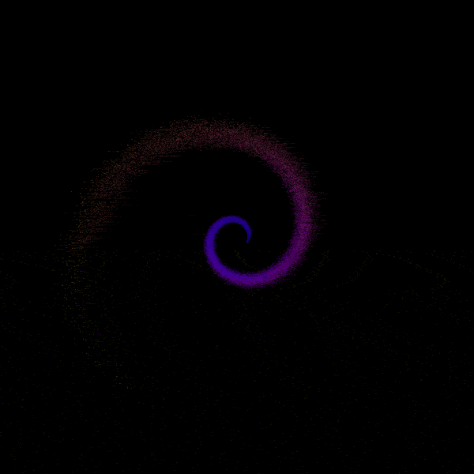

## Install required packages and clone the repository

Use your remote Arm Linux target for all build and run steps.

## Install Arm Performix

Install and configure Arm Performix using the [install guide](https://learn.arm.com/install-guides/performix/). You will need access to a `metal` instance. For this example, I am using a `c7g.metal` instance running `Ubuntu 24.04 LTS`. Additionally, you will need to have the Arm Statistical Profiling Extension (SPE) enabled. 


Install the required system packages:

```bash
sudo apt update
sudo apt install -y git cmake build-essential python3 python3-venv python3-pip
```

Clone the example:

```bash
git clone --branch v1.0 https://github.com/arm-education/Orbiting-Galaxy-Example.git
cd Orbiting-Galaxy-Example
```


## Build with CMake

```bash
mkdir -p build
cd build
cmake ..
cmake --build . --parallel
```

This produces the workload binaries in `build/`.

## Set up a Python virtual environment and run visualization

From the repository root:

```bash
python3 -m venv venv
source venv/bin/activate
pip install --upgrade pip
pip install -r scripts/requirements.txt
```

Generate simulation frames and create the GIF:

```bash
./build/baseline --visualize
python3 scripts/visualize.py
```

The script reads simulation data from `build/galaxy_aos.bin` and writes a GIF into `assets/`.



Use `--visualize` only for understanding the workload behavior. Do not include visualization mode in profiling runs because file I/O alters the measured runtime characteristics.
