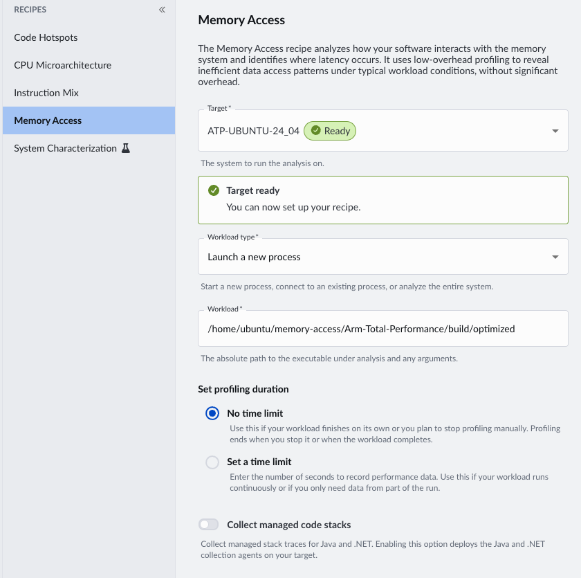
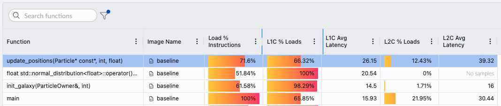
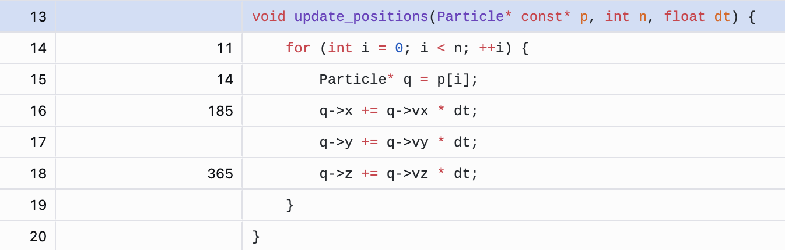

## Inspect the particle data structure

Start by inspecting the baseline particle model in `src/baseline/particle.hpp`.

The baseline implementation stores every property for one particle in a single structure:

```cpp
struct Particle {
    float x, y, z;                   // position      (12 bytes)
    float vx, vy, vz;                // velocity      (12 bytes)
    float mass, charge, temperature; // properties    (12 bytes)
    float pressure, energy, density; //               (12 bytes)
    float spin_x, spin_y, spin_z;    //               (12 bytes)
    float pad;                       // padding        (4 bytes)
};
```

The ownership container in the same file is:

```cpp
class ParticleOwner {
    // Stores particle references used by the simulation.
    std::vector<Particle*> particles_;
};
```

The update loop in `src/baseline/baseline.cpp` repeatedly updates particle positions:

```cpp
for (int iter = 0; iter < iters; ++iter) {
    update_positions(particles.data(), NUM_PARTICLES, dt);
}
```

This baseline design can create avoidable memory overhead:

- `ParticleOwner` stores pointers to separately allocated `Particle` objects, so the hot loop must follow an extra level of indirection.
- Each `Particle` is 64 bytes, but the position update only uses `x`, `y`, `z`, `vx`, `vy`, and `vz`.
- Loading whole particle objects can waste cache capacity and memory bandwidth when the loop only needs a subset of fields.

Before you optimize anything, profile and measure.

## Run the Performix Memory Access Recipe

Open the Performix GUI on your local machine and select the **Memory Access** recipe.

Configure the recipe to launch the baseline workload on your remote Arm target:

- Select the configured remote target.
- Set **Workload type** to **Launch a new process**.
- Set **Workload** to the baseline executable:

```output
/home/ubuntu/memory-access/Arm-Total-Performance/build/baseline
```

Keep the default profiling duration so Performix records until the workload exits.



Start the recipe and wait for the results to load.

## Assess Performance



Look at the memory access results for the baseline binary. Most samples are associated with the `update_positions()` function. The `L1C % Loads` value shows that only about two thirds of loads hit in L1 cache, and the average L1 cache load latency is about 26 cycles. A cache-friendly hot loop should have a much higher L1 hit rate and lower average latency.

To investigate further, check the TLB walk data. As described in the background section, the TLB caches virtual-to-physical address translations. In this run, the `TLB Walk Breakdown` tab shows no significant TLB walks. That means address translation is not the main issue.

In summary:

- Average load latency is about 26 cycles, indicating frequent accesses beyond L1 cache.
- SPE samples are concentrated in `update_positions()`, confirming this loop dominates execution.
- TLB misses are not significant, so page walks are not the source of the slowdown.

Double-click the `update_positions()` row to open the source code view. The source view shows that the samples concentrate on the per-particle position updates.



The result points to a data-layout problem rather than a page-translation problem. In the next section, you use that evidence to guide an optimization.
