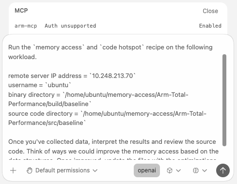
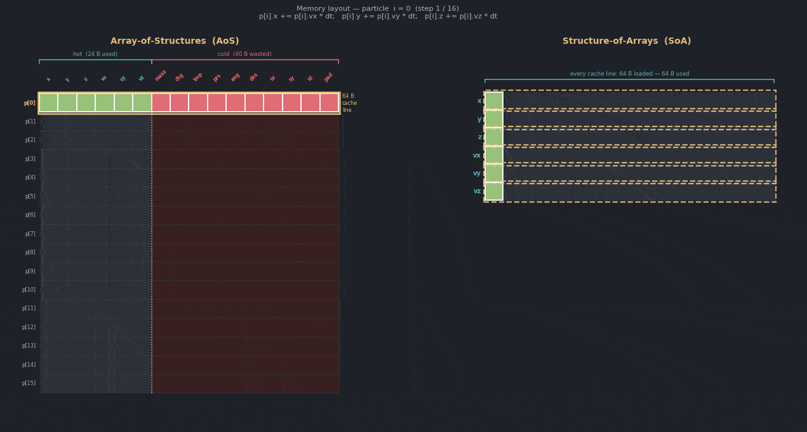
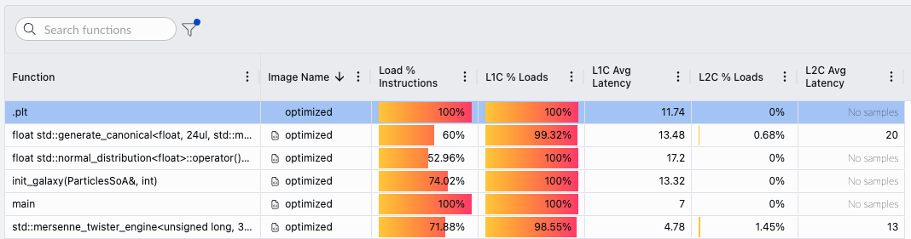

## Optimize Manually

The `src/users_solution/` directory is a copy of the `src/baseline` directory which you can edit. Using the data collected from Performix, refactor the `particle` data structure and associated function signature / call sites to improve the L1 cache hit rate. The baseline result showed that `update_positions()` dominated the samples, had low L1 cache hit rate, and did not suffer from significant TLB walks.

{}

Consider how the `Particle` data structure maps to a 64-byte cache line. Also consider which member variables in the `Particle` struct are used in the hot loop.

{}

Once you have made changes in the `src/users_solution/` directory. You can rebuild the binary with the following commands.

```bash
cd <build dir>
make clean
cmake --build . --parallel
```
Use the Performix GUI to assess and changes in performance for the `<path to build dir>/users_solution` binary. A reference solution is available in the `src/optimized` directory.

### (Optional) Optimize with an AI agent and the Arm MCP server

Alternatively, if you have access to a code assistant such as Kiro, Gemini, Codex or GitHub copilot. The Arm Model Context Protocol (MCP) server has direct tool support to invoke Performix on a remote target. This server integrates into MCP compatible coding assistants and can provide performance insights to LLM-based coding assistants to create a useful feedback loop. The code samples below are for connecting to OpenAI's codex solution, please see the instructions for [your preferred coding assistant](https://learn.arm.com/learning-paths/servers-and-cloud-computing/arm-mcp-server/1-overview/).

{}

You need an OpenAI account to use the Codex CLI.

{}

[Install docker](https://learn.arm.com/install-guides/docker/) and pull the MCP server image. 

```bash
docker pull armlimited/arm-mcp:latest
```

To ensure the MCP server can invoke `performix` on remote machines, pass the optional Docker arguments for your SSH private key and known hosts file. For example, this is the TOML format for the Codex CLI. Add the following to your `~/.codex/config.toml` file: 

```output
[mcp_servers.arm-mcp]
command = "docker"
args = [
  "run",
  "--rm",
  "-i",
  "-v", "/path/to/your/workspace:/workspace",
  "-v", "/path/to/your/ssh/private_key:/run/keys/ssh-key.pem:ro",
  "-v", "/path/to/your/ssh/known_hosts:/run/keys/known_hosts:ro",
  "armlimited/arm-mcp"
]
```

Restart codex and ask your coding assistant to run the `memory access` recipe, interpret the results, and inspect the relevant source code. The prompt can include the remote target, workload binary, and source directory:



## Review the optimized solution

A reference solution is available in the `src/optimized` directory. The baseline stores a vector of `Particle*` values, where each `Particle` is allocated separately and contains all particle fields in one 64-byte structure. The hot loop only needs `x`, `y`, `z`, `vx`, `vy`, and `vz`, but the baseline layout still steps through whole particle objects and performs unnecessary pointer chasing.

The optimized version changes the layout to a Struct of Arrays (SoA). Each field is stored in its own contiguous `std::vector<float>`:

```cpp
struct ParticlesSoA {
    std::vector<float> x, y, z;
    std::vector<float> vx, vy, vz;
    std::vector<float> mass, charge, temperature;
    std::vector<float> pressure, energy, density;
    std::vector<float> spin_x, spin_y, spin_z;
};
```

The `update_positions()` function then walks the hot position and velocity arrays directly:

```cpp
void update_positions(ParticlesSoA& p, int n, float dt) {
    for (int i = 0; i < n; ++i) {
        p.x[i] += p.vx[i] * dt;
        p.y[i] += p.vy[i] * dt;
        p.z[i] += p.vz[i] * dt;
    }
}
```

This removes the `Particle*` indirection and improves cache-line utilization because the hot loop streams through the data it actually uses.

As the graphic below shows, the baseline implementation is on the right, even though each particle is mapped to padded to a 64 Byte cache line, many of the member variables in the struct are not read or written to, hence they are 'cold'. However, by using a structure of arrays all the particles are owned by a single struct but only the data which is touched is loaded into a cache line hence we are not wastefully loading data. 



## Confirm with Performix

After optimization, rerun the Performix Memory Access recipe on the optimized binary. In the Performix GUI, click rerun the recipe and replace the path to the binary from `<path to build dir>/baseline` to `<path to build dir>/optimized`.



The optimized result shows much stronger L1 cache behavior. The hot update path now has `100%` L1C loads in the captured result and a lower average L1C latency than the baseline. This confirms that the data layout change improved locality, not just wall-clock time.

## Measure wall time and memory usage

Run the binaries directly on the remote machine without Performix to compare both wall time and memory usage:

```bash
/usr/bin/time -v <path to build directory>/baseline
/usr/bin/time -v <path to build directory>/optimized
```

We have also instrumented the hot loop with the `scopedTimer` so we can directly observe the speed up from the change. 

```output
Baseline took 571 milliseconds
        Command being timed: "./build/baseline"
        User time (seconds): 0.66
        System time (seconds): 0.02
        Percent of CPU this job got: 99%
        Elapsed (wall clock) time (h:mm:ss or m:ss): 0:00.69
        Average shared text size (kbytes): 0
        Average unshared data size (kbytes): 0
        Average stack size (kbytes): 0
        Average total size (kbytes): 0
        Maximum resident set size (kbytes): 92720
        Average resident set size (kbytes): 0
        Major (requiring I/O) page faults: 0
        Minor (reclaiming a frame) page faults: 22655
...
Optimized took 279 milliseconds
        Command being timed: "./build/optimized"
        User time (seconds): 0.35
        System time (seconds): 0.02
        Percent of CPU this job got: 100%
        Elapsed (wall clock) time (h:mm:ss or m:ss): 0:00.37
        Average shared text size (kbytes): 0
        Average unshared data size (kbytes): 0
        Average stack size (kbytes): 0
        Average total size (kbytes): 0
        Maximum resident set size (kbytes): 64044
        Average resident set size (kbytes): 0
        Major (requiring I/O) page faults: 0
        Minor (reclaiming a frame) page faults: 15500
```


| Metric                | Baseline      | Optimized     | Explanation                                                                                 |
|-----------------------|--------------|--------------|---------------------------------------------------------------------------------------------|
| Wall time (ms)        | 571          | 279          | Optimized layout improves cache usage and eliminates pointer chasing, halving runtime.       |
| Max RSS (KB)          | 92,720       | 64,044       | Struct of Arrays reduces memory footprint by removing per-object overhead and cold fields.   |
| Minor page faults     | 22,655       | 15,500       | Fewer pages are touched due to more compact, contiguous storage of only needed data fields.  |
| L1 cache hit rate (%) | 66.3         | 99.3         | Hot data is now accessed in a cache-friendly pattern, maximizing L1 cache effectiveness.      |
| L1 avg latency (cycles)| 26.2         | 11.7         | Each cache hit takes fewer cycles as we have no pointer chasing   |


## Summary

In this Learning Path, you used Performix and the Arm MCP Server to identify a memory access bottleneck in a C++ particle simulation. You connected the profile data to source code, found that the hot loop suffered from poor data layout and unnecessary pointer chasing, and improved the implementation with a Struct of Arrays layout. You then validated the change with direct wall-time measurements and a second Performix run.

You can use the same MCP server and the `performix` tool to continue through all Performix recipes in an iterative, agentic optimization cycle with the [arm-full-optimization.md](https://github.com/arm/mcp/blob/main/agent-integrations/codex/arm-full-optimization.md) prompt file. This is an agentic approach to performance engineering: use measurement tools, code context, and focused prompts together to iterate on real bottlenecks.
